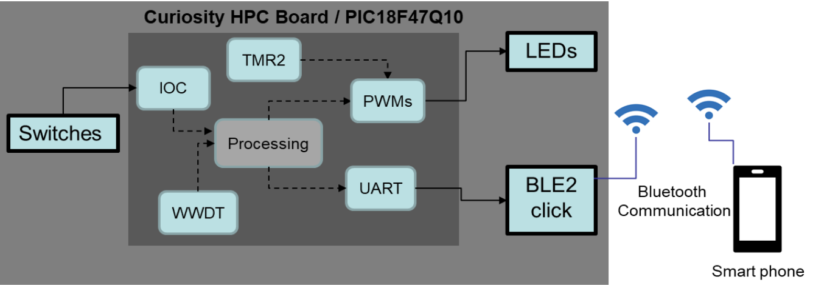
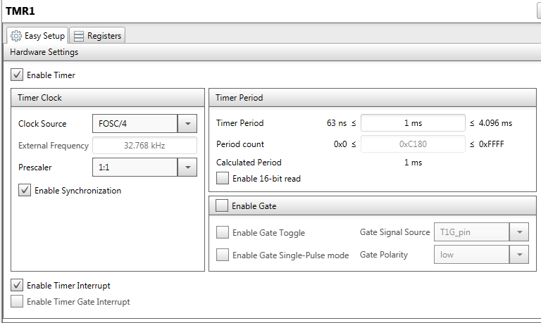
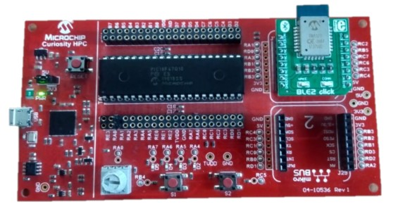
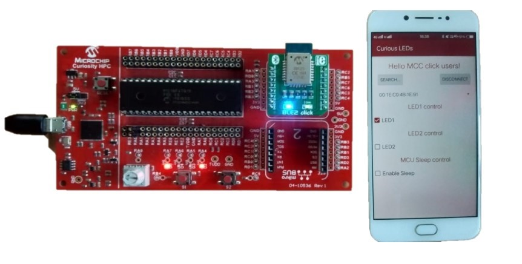
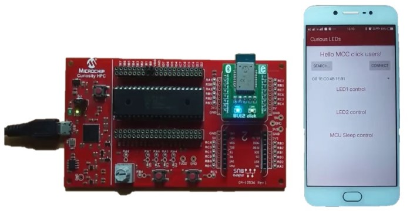
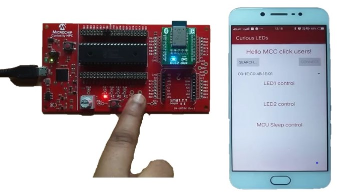

<!-- Please do not change this logo with link -->

# LED Control using Mobile Application through BLE Communication Interface - MPLAB X Project

The PIC18-Q10 family of MCUs are equipped with various core independent peripherals (CIPs) such as PWM, Timer, WWDT etc. The devices can operate in various power saving modes such as idle, doze and sleep mode. The wake up from sleep mode is possible with various options such as external reset input on MCLR pin, BOR Reset, Low-Power Brown-Out Reset (LPBOR), POR Reset, Windowed Watchdog Timer timeout and all interrupt sources except clock switch interrupt.

### Demonstration Video 

## Description 

In this demo, PIC18F47Q10 MCU is used to demonstrate peripheral features of the PIC18-Q10 family of MCUs. This demo highlights usage of PWM peripheral for brightness control and dimming of on board LEDs. Also, showcase the MCU’s sleep mode implementation along with the provision to wake up the MCU by means of either Interrupt on Change (IOC) event or WWDT module.
An android application for mobiles is developed with which users can control functionality of two on-board LEDs (D2 & D3) of the curiosity HPC board by sending commands to the MCU over Bluetooth communication.
Using the android application,
* Turn On/Off and control brightness of LED D2
* Turn On/Off dimming feature of LED D3
* Enable or disable sleep mode of the MCU

## LED Dimming and Control through BLE Mobile Application

This demo uses curiosity HPC board along with a BLE2 click board for wireless connectivity. The below figure shows block diagram view of the application demo. 

  
   <strong>Block Diagram 

In this application, PWM3, PWM4, timer2, WWDT, UART modules and interrupt on change (IOC) feature of the MCU are configured. The MCU communicates with BLE2 click board over the UART interface.

The state of on-board LEDs (D2 and D3) is controlled through the mobile application. Upon Checking/enabling LED1 option in the mobile application, LED D2 starts dimming (dims up and down) automatically and this repeats in a continuous loop. The brightness of LED D2 changes by varying duty cycle of the PWM3 module and at a rate of 100ms.

**Note:** The brightness of LED D2 starts at 0% and gradually increases to 100%, while the PWM duty value gradually increases from 0 to 100%. Once the PWM duty cycle reaches to 100%, it starts decreasing from 100% to 0%. So, brightness of the LED D2 also gradually decreases and reaches to 0%. This whole cycle repeats in a continuous loop.

The On/Off state of LED D3 and its brightness is controlled through LED2 option (and through scroll bar) available in the mobile application. The PWM4 module of MCU is used for brightness control of the LED D3. Based on the status of scroll bar, appropriate PWM duty cycle value is set to drive the LED D3.

The sleep mode of MCU can be enabled or disabled by controlling the “Enable Sleep” option in the mobile application. The MCU operates only in active mode when “Enable sleep” option is unchecked. If “Enable sleep” option is checked, sleep mode operation of the MCU is enabled. In sleep mode, the MCU periodically wakes up from sleep for every one-minute. After waking up from sleep, the MCU sends a command to the BLE module to exit from deep sleep mode by changing “Wake_SW” signal level to high. Then after, the MCU sends a command to place the BLE module in advertise mode. In advertise mode, the BLE module re-establish connection with the mobile app whenever the users intend to connect with the BLE module. Hereafter, the users can control on-boards LEDs of the curiosity HPC board through mobile app. If there hasn’t any connection request from the mobile app for next one minute, the MCU places the BLE module in deep sleep mode and goes back to sleep. The MCU continues to stay in sleep until the next WWDT timeout event or detection of a push button (S1/S2) press event.

The MCU exits from sleep mode in two ways; one way is whenever user presses either of the push buttons S1 or S2 (using the interrupt on change feature) and the second way is upon the occurrence of WWDT timeout event. In the demo, WWDT timeout period is set to approximately one minute (67.45 seconds). To a button press event, the MCU instantly wakes up from sleep and goes into active mode.

**Note:**
* Sleep period is configurable in the firmware.
* The WWDT timeout period is configurable by changing the divide ratio value. The possible WWDT timeout period values are 1, 2, 4, 8, 16, 33, 67, 135 and 270 seconds.

## Software Used

Make sure that the latest software libraries are installed. The demo/example uses the following version of software tools from Microchip.

* [MPLAB® X](https://www.microchip.com/mplab/mplab-x-ide) (v5.40)
* [XC8 compiler](https://www.microchip.com/mplab/compilers) (v2.30)
* [MPLAB® Code Configurator](https://www.microchip.com/mplab/mplab-code-configurator) (v4.0.1)
* [DFP Pack](https://packs.download.microchip.com/) (v1.8.154)
 
### Android version

* The android application is developed using Android OS version Marshmallow (6.0.1) API level 23.
* The application supports android versions from Jelly bean 4.3.x (API level 18 to Oreo 8.0.0 (API level 26).
* The apk file for the android application can be downloaded here: [Curious LEDs.apk](https://microchiptechnology-my.sharepoint.com/personal/namrata_dalvi_microchip_com/_layouts/15/onedrive.aspx?id=%2Fpersonal%2Fnamrata%5Fdalvi%5Fmicrochip%5Fcom%2FDocuments%2FEXT%5Fcurious%20LEDs%2Eapk&parent=%2Fpersonal%2Fnamrata%5Fdalvi%5Fmicrochip%5Fcom%2FDocuments&originalPath=aHR0cHM6Ly9taWNyb2NoaXB0ZWNobm9sb2d5LW15LnNoYXJlcG9pbnQuY29tLzp1Oi9nL3BlcnNvbmFsL25hbXJhdGFfZGFsdmlfbWljcm9jaGlwX2NvbS9FZks5Sm9MLXRvaEh2R1ZvYmh1YXhMMEJrRzNnM3k1cGdYOGFQSm5aN0pIWVB3P3J0aW1lPWJrYVJtdFJmMkVn)

## Hardware Used

* [Curiosity High Pin Count (HPC) Development Board](https://www.microchip.com/Developmenttools/ProductDetails/DM164136)
* USB Cable  
* [BLE2 Click](https://www.mikroe.com/ble-2-click) 
 
## MCC Configuration

This section shows the settings used in demo/example for various MCU modules configuration. These settings were done using the Microchip Code Configurator (MCC). Open MCC to look at the settings of the modules.

### System Module:

In “Registers” view, RSTOSC is configured as HFINTOSC with HFFRQ = 64 MHz and CDIV = 1:1

  
   <strong>System Module Window 

### Timer 2 settings:

Selected timer 2 as the time base for PWM3 module and FOSC/4 as clock source. The Pre-scaler selected is 1:128. Set timer period as 2ms to get PWM frequency of 500Hz. Selected “Roll over pulse” option for Control mode parameter and “Software control” for Start/Reset option.

  
   <strong>Timer2 Window 

### PWM3 settings:

Configured timer2 for PWM3 operation. Set initial duty cycle as 0%. The PWM3 module is used to control brightness of the LED1 (D2 on curiosity HPC board). PWM frequency can be varied by changing the Timer Period of timer2.

  
   <strong>PWM3 Window 

### PWM4 settings:

Configured timer4 for PWM4 operation. Set initial duty cycle as 0%. The PWM4 module is used to control brightness of LED2 (D3 on curiosity HPC board). PWM frequency can be varied by changing the Timer Period of timer4.

  
   <strong>PWM4 Window 

### WWDT settings:

Configured “WWDT timer enable” parameter as “WDT enabled/disabled by SWDTEN bit” to enable WWDT module before the MCU goes to sleep and disable after waking up from sleep. The clock source for WWDT is selected as 31KHz LFINTOSC to operate it in the sleep mode. The timeout period for WWDT is selected as 67.65 seconds using divider ratio of 1:2097152. The possible WWDT timeout period values are 1, 2, 4, 8, 16, 33, 67, 135 and 270 seconds by changing the divider ratios.

  
   <strong>WWDT Window 

### Timer 1 settings:

The clock source for timer 1 is selected as FOSC/4 along with the prescaler of 1:1 and the timer period is set to 1ms. The timer interrupt is enabled. Timer 1 is used to generate timer ticks for every 1ms which is used for scheduling various timely activities.

  
   <strong>Timer1 Window 

### BLE2 Click Configuration:

Selected BLE2 form “Device Resources -> Mikro-E Clicks-> Wireless Connectivity -> BLE2”.

  
   <strong> 

In BLE2 "Configuration" tab, unchecked "Generate Example" option.

  
   <strong>BLE2 Window 

Under advanced settings, selected EUSART1 option from drop down menu which has selected normal EUSART1 module (not the foundation service).

  
   <strong>BLE2 Window 

### EUSART settings:

Selected Baud Rate as 115200.

  
   <strong>EUSART Window 

### Pin manager grid view:

Configured pins RB4 (SW1) and RC5 (SW2) as input ports (pin module --> GPIO --> input). Configured pin RA7 (LED D5) as output port. Configured pin RA4 as PWM3 output to control LED1 (D2). Configured pin RA5 as PWM4 output to control LED2 (D3).

  
   <strong>Pin Manager Window 

### Pin module settings:

Configured pins RB4 (SW1) and RC5 (SW2) as input ports (pin module --> GPIO --> input). Configured pin RA7 (LED D5) as output port. Configured pin RA4 as PWM3 output to control LED1 (D2). Configured pin RA5 as PWM4 output to control LED2 (D3).

  
   <strong>Pin Module Window 

### Interrupt module:

The Pin module IOCI interrupt is not enabled.

**Note:** The Interrupt on change feature for SW1 (RB4) and SW2 (RC5) is only used for waking upConfigured pins RB4 (SW1) and RC5 (SW2) as input ports (pin module --> GPIO --> input). Configured pin RA7 (LED D5) as output port. Configured pin RA4 as PWM3 output to control LED1 (D2). Configured pin RA5 as PWM4 output to control LED2 (D3). the device from sleep mode so the IOC interrupt is only enabled before executing the SLEEP command and after waking from sleep the IOC interrupt is disabled.

  
   <strong>Interrupt Module Window 

## Demonstration Setup

The following connections should be done on the curiosity HPC board.

1 Place BLE2 click board in mikroBUS slot 1 of the curiosity HPC board.

  
   <strong>Hardware Setup 

2 The table below shows list of PIC18F47Q10 MCU port pins used in the example along with appropriate signal names.

<table>
<thead>
<tr>
<th>S.No</th>
<th>PIC18F47Q10 MCU Pin</th>
<th>Signal</th>
<th>Board</th>
</tr>
</thead>
<tbody>
<tr>
<td>1</td>
<td>RA4</td>
<td>PWM3 (LED D2)</td>
<td>Curiosity HPC Board</td>
</tr>
<tr>
<td>2</td>
<td>RA5</td>
<td>PWM4 (LED D3)</td>
<td>Curiosity HPC Board</td>
</tr>
<tr>
<td>3</td>
<td>RA7</td>
<td>Activity Indicator (LED D5)</td>
<td>Curiosity HPC Board</td>
</tr>
<tr>
<td>4</td>
<td>RB4</td>
<td>SW1</td>
<td>Curiosity HPC Board</td>
</tr>
<tr>
<td>5</td>
<td>RC5</td>
<td>SW2</td>
<td>Curiosity HPC Board</td>
</tr>
<tr>
<td>6</td>
<td>RA1</td>
<td>Conn</td>
<td>BLE2 Click</td>
</tr>
<tr>
<td>7</td>
<td>RD0</td>
<td>Wake</td>
<td>BLE2 Click</td>
</tr>
<tr>
<td>8</td>
<td>RC6/TX</td>
<td>UART RX</td>
<td>BLE2 Click</td>
</tr>
<tr>
<td>9</td>
<td>RC7/RX</td>
<td>UART TX</td>
<td>BLE2 Click</td>
</tr>
<tr>
<td>10</td>
<td>RC2</td>
<td>CMD/MLDP</td>
<td>BLE2 Click</td>
</tr>
</tbody>
</table>

## Operation 

* Power on the curiosity HPC board using USB micro cable connected to the PC.
* Program the PIC18F47Q10 device on curiosity HPC board using on-board programmer.
* In active mode of the MCU, LED D5 on the board flashes at a rate of one second. Whereas in sleep mode, the LED D5 gets turned off.

  
   <strong>Curiosity HPC with BLE2 Click board 

* Install android application (Curious LEDs) in the mobile.

### Mobile application setup:

* Allow the application to turn-on Bluetooth service in the mobile. Ignore this step if Bluetooth is already turned-on in the mobile.
* Enable GPS service and turn-on location service in the mobile. Ignore this step if location service is already turned-on in the mobile.
* In the application, click on “Search” button. Then after, BLE module in the mobile scans all the nearby BLE devices. Once the search operation is completed, select appropriate BLE device (i.e. BLE2 click) from the list of devices found, and click on “Connect” button to pair with the BLE2 click. Once connected to the BLE2 click, the “connect” button in the app turns into “Disconnect”.

  
   <strong> 

* In the application, check “LED1” option to turn-on LED D2 on the curiosity HPC board. Then after, the LED starts dimming automatically. The LED’s brightness gradually dims up and down, and this repeats in a continuous loop. The brightness of LED starts at 0% and gradually increases to 100%. Once the brightness level reaches to 100%, it gradually decreases and reaches to 0%.

  
   <strong> 

Uncheck the LED1 option, then LED D2 gets turned off.

* Check “LED2” option to turn-on LED D3 on the curiosity HPC board. Then after, LED D3 turns on. Adjust scroll bar below “LED2” option to vary brightness of the LED. The brightness can be varied from 0 to 100 %.

  
   <strong> 

Uncheck the LED2 option, then LED D3 gets turned off.

* Enable sleep mode of the MCU by checking “Enable Sleep” option under the "MCU Sleep Control" section. Check LED1 and LED2 options. The LED D2 starts dimming (up and down) continuously and the LED D3 turn-on with a brightness based on the value selected through scroll bar.

  
   <strong> 

If there hasn’t any activity through the mobile app for more than one min, then the MCU keeps BLE2 click into deep sleep, enables WWDT module and goes into sleep mode. The android app gets disconnected with the BLE2 click.

  
   <strong> 

In sleep mode, the WWDT module generates timeout event after one minute. Once timeout occurs, the WWDT module generates trigger to wake up the MCU from sleep. The MCU resumes its operation from where it had stopped before going into sleep mode.

**Note:** Alternatively, users can instantly wake up the MCU from sleep mode using either of the push buttons (S1 or S2).

  
   <strong> 

  

* Repeat third point of "Mobile application setup" to re-establish connection between mobile application and BLE2 click. Once the connection is established, control the LEDs through mobile application.
* If there hasn’t any activity through the mobile application for more than one minute, the MCU once again goes back into sleep mode and wakes up after one minute. To disable sleep mode, uncheck the “Enable Sleep” option.

## Conclusion 

This demo example demonstrates usage of the PIC18-Q10 MCUs PWM and timer modules together in an application to control brightness/dimming of LEDs. The LEDs are controlled through android application (for mobiles) and via the Bluetooth communication.

Also, demonstrates sleep mode implementation in PIC18-Q10 family of MCUs, which is essential to conserve power in power critical or battery powered applications. The wakeup feature is demonstrated with the help of WWDT module and interrupt on change (IOC) event.
